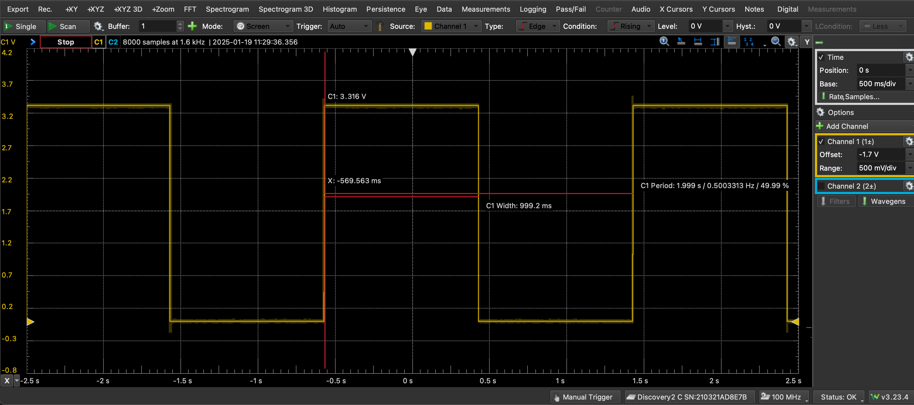
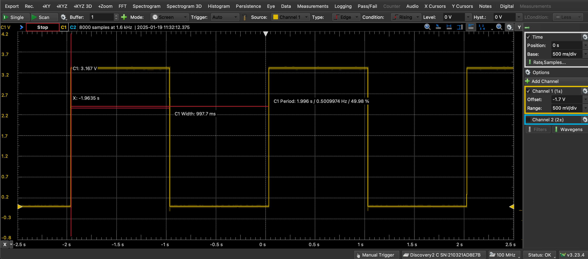

# Project 1 Heartbeat LED

## Goal

In this project The MSP430 will be programmed to Blink both LEDs at 0.5 hz with two different methods. The first method on the red LED will be to use a delay loop to wait until the LED should be toggled. The second method on the green LED will be to set a timer interrupt to toggle the LED at a given time.

## Main Loop Flowchart

*Figure 1: Main Loop Flowchart*

## Red LED delay loop

### Code Design

*Figure 2: Flash Red LED Flowchart*

*Figure 3: Delay Flowchart*

Figures 2 and 3 show the logic for the code design of the red LED running on the delay loop.

### Code implimentation

First the delay loops were implimented with arbitrary indecied to confirm the overall functionality of the code. After the functionality was confirmed the indeces were set: inner at 50,000 and outer at 10. This was approximately 0.2s off of spec. After tuning the indecies 5,000 and 72 respectively.

*Figure 4: Red LED oscilloscope reading*

Figure 4 shows the accuracy of the timing from the final code solution.

## Green LED delay loop

### Code Design

*Figure 5: Flash Green LED Timer B0 Flowchart*

Figure 5 shows the logic for the code design of the green LED running on the timer interrupt.

### Code implimentation

First the P6.6 output corresponding the the green LED was set up and tested. Then the timer B0 was initialized with an overflow configuration. This was then tested and no tuning was required

*Figure 6: Green LED oscilloscope reading*

Figure 5 shows the accuracy of the timing from the final code solution.
